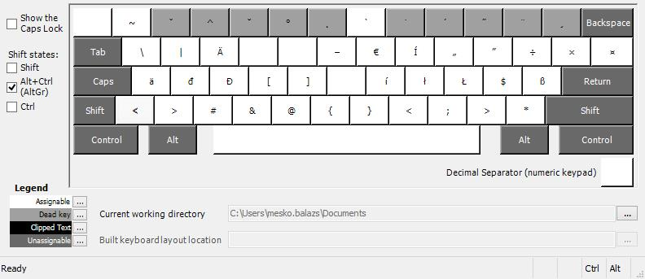

# Hungarian Keyboard Layout with Special Characters

Special Hungarian keyboard layout with localizers in mind. Adds a few useful key combinations, similarly to common Linux distributions.

## Layout Preview

## Installation

Just install the MSI from the release ZIP, or generate the installers yourself with Microsoft Keyboard Layout Editor from the KLC file.

